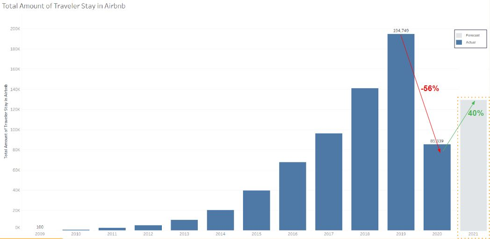

# New York City (NYC) Airbnb Listings Segmentation using RFM Analysis

## Overview / Case Background
Airbnb is an online marketplace which provides homestay or tourism services. Airbnb presence disrupts hotel and inns market. New York City is no exception. NYC is the most populous city in US, center of finance, media, government, research, and technology. NYC is also the biggest revenue generator for Airbnb in the US, because there are always traveler going to NYC, and the amount of listings of NYC Airbnb is the largest in US. The **occupancy rate of Airbnb in NYC is only 50%**, compared to its direct competitor, hotel, is around 90% in 2019. Then, Covid-19 hits in 2020, and **Airbnb is also affected by -56% yoy** decreasing of traveler's stay in 2020. We're assigned to **increase traveler's stay in Airbnb to +40% yoy in 2021** by **maximing high performance listings and giving recommendation to low performance listings** by the end of 2021.

## Possible Causes

## Data Source
1. [listings_dataset](https://drive.google.com/file/d/1u98aNFkoMSh-wO973HG9rl57MhCUJJCD/view?usp=sharing).
2. [reviews_dataset](https://drive.google.com/file/d/10NbikSxI_GtZsTxVmx6_hcIpAwvH5RMj/view?usp=sharing).

## Data Preparation and Cleaning
1. Not all columns will be selected for analysis process, only columns with related information will be used.
2. Check for missing value, data types, duplicate values, invalid values, and outliers.
3. Renaming columns name for clarity purpose.
4. Create additional columns (variables) to be used for analysis later (`Recency`, `Frequency`, `Monetary`)
5. Join all required column and table to one dataframe named as dfco, using merge functions in python.

## EDA Process
In this process, we find initial insights, such as:
1. Manhattan has the most total room available in NYC Airbnb listings, followed by Brooklyn, Queens, Bronx, and Staten Island.

2. Entire home/apartement type of listings is very dominant in NYC Airbnb listings, primarily in Brooklyn and Manhattan borough. While Private Room is dominant in Queens, Hotel Room and Shared Room only show very little percentages in five neighbourhoods.

3. Total Airbnb beds only 32% of total hotel bed / inns in NYC. With total visitors to NYC is 66.6 mil on 2019. 

## Listing Segmentation using RFM Analysis
For RFM analysis (Recency, Frequency, Monetary). Following columns will be use for references:
1. `Recency` for Recency Score
2. `Frequency for Frequency Score
3. `Monetary` for Monetary Score

After columns ready to be analysed, create a ranking based on those column, and normalize the rank of the listings.

For scoring method:
We are going to rate the listings on a scale of 5, based on their normalized value. Formula used for calculating RFM score is
`0.15*Recency Score + 0.28*Frequency Score + 0.57*Monetary Score`

In order to create customer segmentation, following columns will be used for references:
1. Creating new columns, called `payment_installments_cat`, which categorize payment installment to 4 category named:
    - 'no debt-debt club' for payment made without or using 1 month installments
    - 'pinjol friendly' for payment made using 2 to 6 months installments
    - 'medium term' for payment made using 7 to 12 months installments, and
    - 'long commitment' for payment made using more than 12 months installments
2. Column `customer state` and `payment type` is converted to numeric using one hot encoding.
3. Optimal number of cluster is 4, based on elbow method metric.

4. Then, the summary of each cluster is shown in table below:

